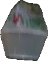
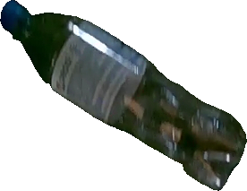
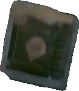
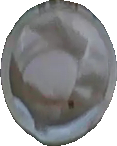
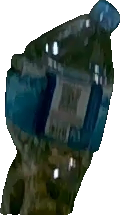
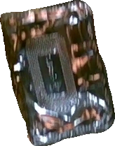
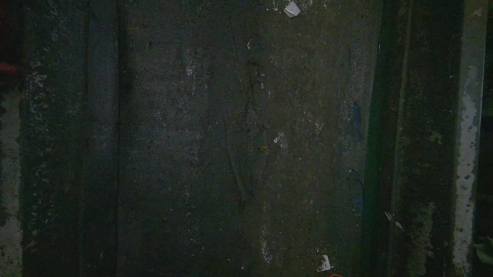

# Crop and Pasting
**Problem & Solution**: Data shifting problem causing unbalanced class distribution  
**Task**: Recycling waste data crop and paste augmentation technique via Segment Anything Model (SAM)  
**Object information**: Recycling waste objects on a conveyer belt  
**Main Project**: KNU Industry-Academia Cooperation Project **[[Link]](https://github.com/knu-on-plus/Data-generation-solution-for-recycling-waste-classification)**  
Worked by [Hojun Song](https://github.com/hojunking)
### Crop and paste condition for waste domain

1. **Background**
    1. objects must be pasted inside the conveyor belt area in an empty conveyor belt image.
    2. should not go outside the belt area based on the creation coordinates.
2. **Objects**
    1. objects should be saved at their cropped size.
    2. when saving, remove the background of the object through the alpha channel.
    3. .png format must be used to apply the alpha channel.
    4. up to N objects can be glued together.
    5. allow up to N% overlap between objects.


### 1. Generate masks with SAM(Segment Anything Model)([Link](https://github.com/facebookresearch/segment-anything))
- Get segmentation mask via object detection bounding box (already have labeled data)  


### 2. Crop objects with generated masks
- **Load Object Images with Cropped Masks**
- **Apply Alpha Channel to Cropped Objects**
        <p align="left">  
     
    
    
    
    </p>
    <p align="left">  
     
    
    
    </p>

### 3. Paste objects on empty conveyer belt

  


- **Configuration Parameters in ``crop_paste.py``**
    ```python
    CFG = {
    'base_image_path': '../wim_data/SAM_2_objects/conveyer_resized.png', # Back ground image (to be pasted)
    'object_images_folder': '../wim_data/objects/images_object2/', # Object images path
    'max_objects' : 12,  # max objects to paste
    'rectangle' : (300, 0, 680, 740), # Setting ROI (x start, y start, width, height)
    'max_overlap': 0.3, # Overlapping ratio with objects
    'num_iter': 3, # number of images to be generated
    'max_dim': 500, # Number of sampled object images limit
    'output_folder': '../wim_data/crop_paste/', # generated images save path
    }
    ```
- **Randomly Fewer Ratio Classes Pasting Algorithm**  
    Depends on number of class distribution, sampled more from fewer classes to solve unbalanced class distribution problem.  
    

### Framework


### 4. Result Examples

<p align="left">  
 
</p>
<p align="left">  
 
</p>
